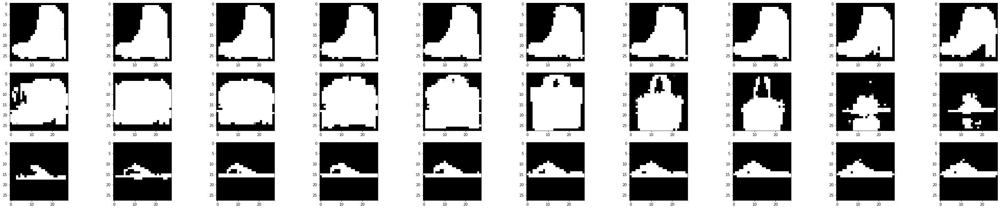
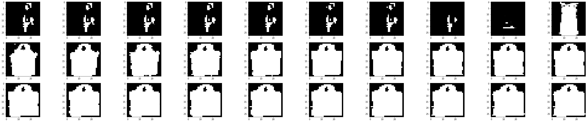
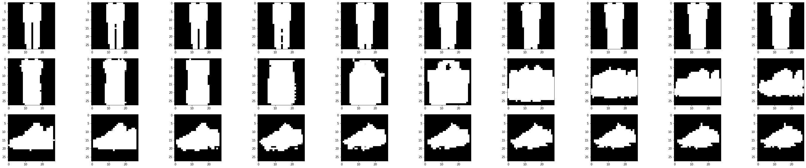
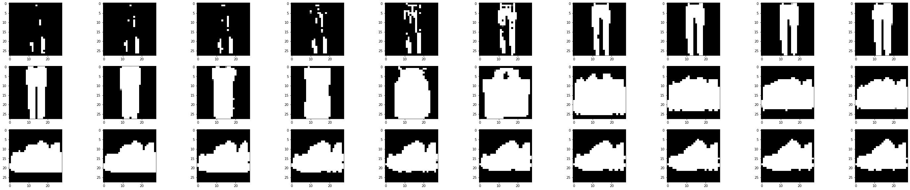
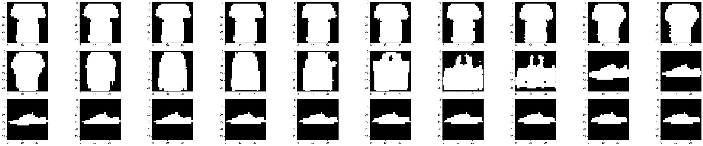
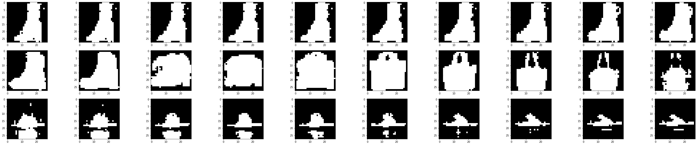
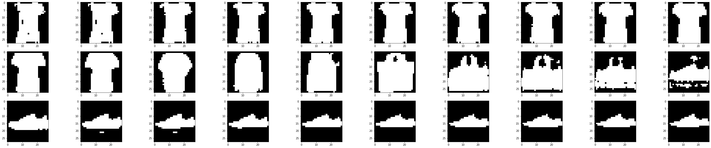

# README

这个小project是在大二下深度学习基础课程上做的，第一次知道何恺明做了Mask AutoEncoder之类的东西，第一次知道可以从掩盖了75%的数据中去恢复得到原数据，是自己低估了网络权重中隐含表示性的可能性，真的非常有意思。

这个小项目也学习一下AutoEncoder，具体的工作：

> 博客见：[用AutoEncoder做一些有趣的事情 - Link_kingdom - 博客园 (cnblogs.com)](https://www.cnblogs.com/Linkdom/p/17149450.html)
>
> 代码见：

- 代码在`autoEncoder_origin.ipynb`和`convAutoEncoder.ipynb`，前者尝试了最基础的自动编码机的编码能力，后者使用卷积的autoencoder来编码解码；

- 数据集使用了mnist俩个数据集（一个最经典的，另一个FashionMnist，只需要切换一下datasets那里的数据运行便可以看到效果）。

- 本笔记特意投影到三维的区间方便用三维空间画出十类数据在autoEncoder降维之后是如何分布的，我们通过三维图看到相同的数据还是分布在一块，也就是说明了降维成功了。而且这些数据也能很好的刻画原数据的值（最后的测试集可以看到效果）。
- 最后利用测试集的数据进行随机的图片生成，这里的应用我们可能以后会想到token的应用，提取关键词，用decoder生成图片（对应之后的diffusion模型）
- 我们知道编码机会输出一个三维向量，那么我们便线性地去改变三维向量的值，直接输入给decoder，看一下生成的图像结果变化。效果如下：

> 随着decoder输入值的线性变化，直接生成的图片也是”渐渐“地发生改变，从一些细节特征上慢慢转变成了另一个类别的图片